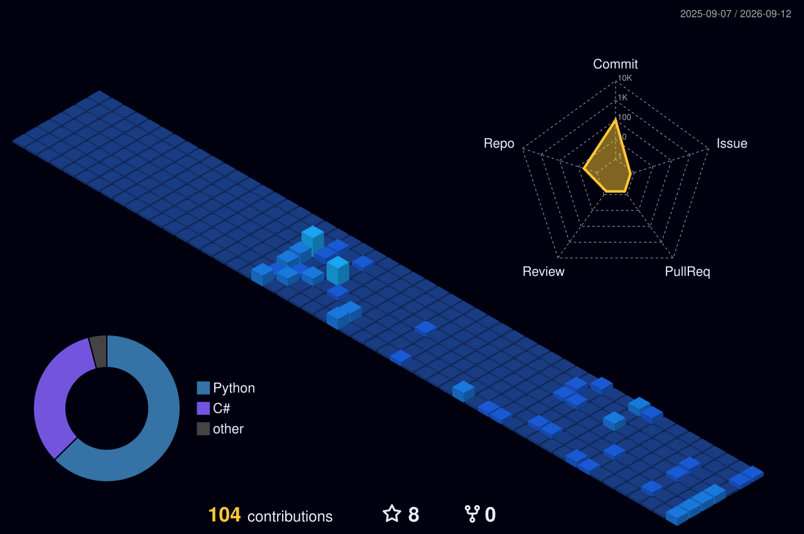

# 你好

我是一名高二在读学生，喜欢编程，做一些实用也有趣的小工具

---

### 动态

### 我的项目
- **[FkBlocks/class-toolkit ](https://github.com/FkBlocks/class-toolkit/)** 适用于大屏一体机的悬浮球工具箱 (原型，正式版待开发)
   
- **[FkBlocks/BetterNote ](https://github.com/FkBlocks/BetterNote/)** 新一代教学书写白板 (开发中)
   

### 我的技术栈
- 比较擅长的语言和框架 \
  
  
  

- 还在学习 \
  
   

- IDEs \
  
  

---

### 我的联系方式
- 微信：Hoshino20100421
- QQ：3351365071
- 邮箱：Fangk1589969@outlook.com